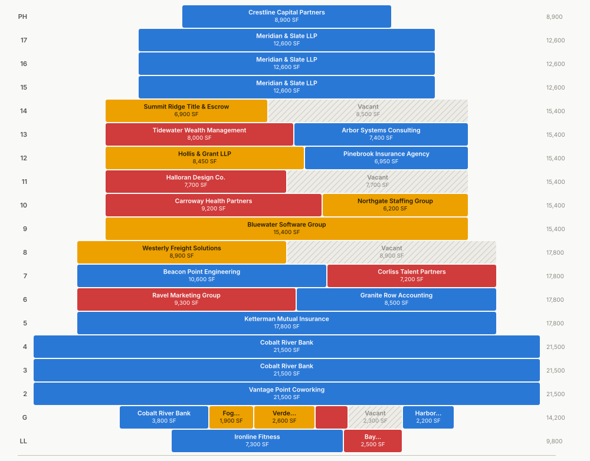

# Stacking Plan Builder

An interactive, open-source **stacking plan** for commercial real estate — feed it a CSV of
suites and it renders the building: every floor, every suite, colored by lease-expiration
risk, with a timeline you can scrub to watch the rent roll play out.

No build step, no dependencies, no server. One HTML file, one script, one stylesheet —
double-click `index.html` or host it on GitHub Pages.

**Live demo:** [ashbybrewer.github.io/stacking-plan-builder](https://ashbybrewer.github.io/stacking-plan-builder/)

<picture>
  <source media="(prefers-color-scheme: dark)" srcset="docs/preview-dark.svg">
  
</picture>

## Why a stacking plan?

The stacking plan is the one-page answer to the questions every owner, broker, and lender
asks about an office building: *who is in the building, where, on how much space, and when
does it roll?* It's a cross-section — floors stacked top to bottom, each floor divided into
its suites, each suite colored by how soon its lease expires. Concentration risk, rollover
exposure, and vacancy all become visible in a glance.

## Features

- **CSV in, building out.** Drag a CSV onto the page (or click *Load CSV*). Column names
  are matched loosely — `rsf`, `area`, `expiration`, `lease_end` all work.
- **Time scrubber.** Drag the *As of* slider (or press ▶) to move up to 10 years into the
  future and watch suites roll to vacant as their leases expire. Every number on the page —
  occupancy, WALT, rollover, colors — recomputes against the as-of date.
- **Expiration-risk coloring.** Red = expiring ≤ 12 months (including month-to-month),
  amber = 1–3 years, blue = 3+ years, hatched gray = vacant.
- **Hover / tap a suite** for tenant, SF, rent, term, and time remaining. Hovering a tenant
  highlights *all* of their suites — multi-floor concentration jumps out.
- **KPIs that matter:** total RSF, occupancy, **WALT** (SF-weighted average lease term),
  SF expiring in the next 12 months, annual rent, top tenant.
- **Lease rollover chart** — occupied SF by expiration year.
- **Rent roll table view** — the same data as a sortable-by-floor table (and the
  accessibility fallback for everything the chart encodes).
- **Building silhouette.** Floor width is proportional to floor RSF, so podiums and
  setbacks read like the actual massing.
- **Export SVG** of the current view. Light & dark themes. Works on a phone.

## Quick start

```bash
git clone https://github.com/ashbybrewer/stacking-plan-builder
open stacking-plan-builder/index.html
```

Click **Sample** to load the bundled demo building, or drop in your own CSV. The app is
pure static files, so any static host works — this repo serves the live demo straight
from GitHub Pages.

## CSV format

One row per suite. Only `floor` and `sqft` are required.

```csv
floor,suite,tenant,sqft,lease_start,lease_end,rent_psf,use
12,1201,Hollis & Grant LLP,8450,2019-06-01,2029-05-31,49.00,Office
12,1202,Pinebrook Insurance Agency,6950,2021-09-01,2031-08-31,47.25,Office
11,1101,,7700,,,,Office
```

| Column | Aliases accepted | Notes |
|---|---|---|
| `floor` | `level`, `flr`, `story` | Numbers, plus `G`, `LL`, `B1`, `M`, `PH`, `RF` — sorted like a building |
| `suite` | `unit`, `space` | Optional; natural-sorted within the floor |
| `tenant` | `name`, `lessee`, `occupant` | Blank, `Vacant`, or `Available` ⇒ vacant suite |
| `sqft` | `rsf`, `sf`, `area`, `size` | Required, numeric |
| `lease_start` | `start`, `commencement` | `YYYY-MM-DD` or `M/D/YYYY` |
| `lease_end` | `expiration`, `expiry`, `end` | Blank with a tenant ⇒ month-to-month |
| `rent_psf` | `rent`, `rate`, `base_rent` | If the median looks like annual rent, it's treated as annual and divided by SF |
| `use` | `type`, `category` | Free text, shown in the tooltip |

A full example lives in [`data/sample-building.csv`](data/sample-building.csv).

## Definitions used

- **Bucket boundaries** are measured from the as-of date: ≤ 12 months, 12–36 months,
  &gt; 36 months. Month-to-month tenants (no expiration) count as immediate exposure.
- **WALT** = Σ(suite SF × years remaining) ÷ occupied SF, month-to-month counted at 0.
- **Occupancy** = occupied SF ÷ total RSF.
- **Rollover** = occupied SF grouped by lease-expiration year, computed at the as-of date.
- Scrubbing past a lease's expiration renders the suite **vacant** (its tooltip remembers
  the prior tenant and roll date) — no renewal assumptions are made.

## Design notes

- **Why blue for "safe" instead of the traditional green?** The classic red→green risk
  scale collapses for red-green colorblind readers — simulated deuteranopia puts the
  red/green pair at ΔE ≈ 4 (indistinguishable). This palette
  (`#d03b3b` / `#eda100` / `#2a78d6`) was validated under protanopia/deuteranopia
  simulation in both themes (worst pair ΔE ≥ 10) — and vacancy carries a hatch pattern,
  so no state is encoded by color alone.
- Values shown in tooltips are never *only* in tooltips: suite labels render when they
  fit, and the rent-roll table carries everything.
- Tenant names from CSVs are inserted with `textContent` only — no HTML injection.
- Zero dependencies: ~14 KB CSS, ~36 KB JS, vanilla DOM + SVG. Works from `file://`.

## License

[MIT](LICENSE)
